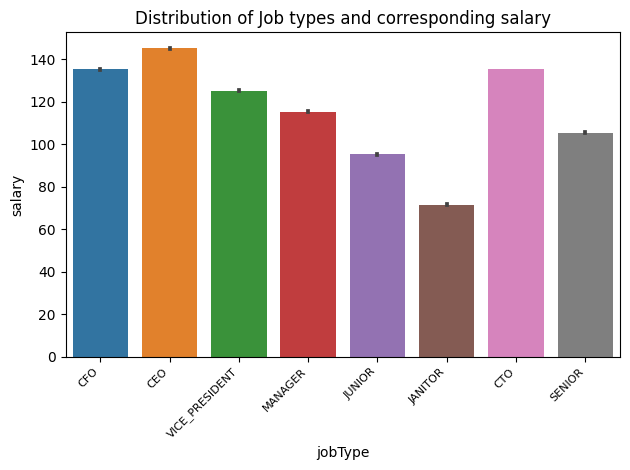

# EmployeeRetentionAI
A comprehensive repository for analyzing and predicting employee attrition, providing insights and tools for better talent retention strategies.
This repository contains the code and data files for training and testing a machine learning model to predict employee retention. The model is built using the provided training dataset and evaluated on the test dataset. Additionally, the repository includes an exploratory data analysis (EDA) Jupyter notebook, which explores the dataset, checks for missing values, analyzes categorical variable associations, and examines multicollinearity.

## Dataset

The dataset used in this project includes two files:

- `training_dataset.csv`: This file contains the mock data for training the machine learning model. It includes various features such as job type, degree, major, industry, experience, milesfromwork, and salary.

- `test_dataset.csv`: This file contains the mock data for evaluating the trained machine learning model. It has the same structure as the training dataset.

## EDA Notebook

The Jupyter notebook `EA-dataset-EDA.ipynb` provides an in-depth analysis of the dataset. It performs the following tasks:

1. Describes the dataset, providing an overview of the available features and their meanings.
2. Checks for missing values in the dataset, ensuring the data quality.
3. Performs a chi-square test to analyze the association between categorical variables, helping understand the relationships within the dataset.
4. Utilizes the VIF (Variance Inflation Factor) test to detect multicollinearity among the numerical variables, identifying any high correlations.
5. Generates various visualizations to visualize the dataset, including plots such as histograms, scatter plots, and bar plots.

## Visualizations

The `EDA-figs` folder contains the visualizations generated during the exploratory data analysis. One of the figures, named `job_salary.png`, displays the salary range for different job types using a marplot. The marplot visualizes the relationship between job types and corresponding salary ranges.

This plot provides insights into the salary distribution across different job types, helping understand the salary structure within the organization.

## Model building

Coming soon...

## Acknowledgments
Thanks to cloudyml platform for the dataset and the project description.

Feel free to explore the repository and use the provided code and data for your own analysis or further enhancements.
For any inquiries or further information, please feel free to contact me at pritigupta.ds@gmail.com
Enjoy analyzing employee retention!
